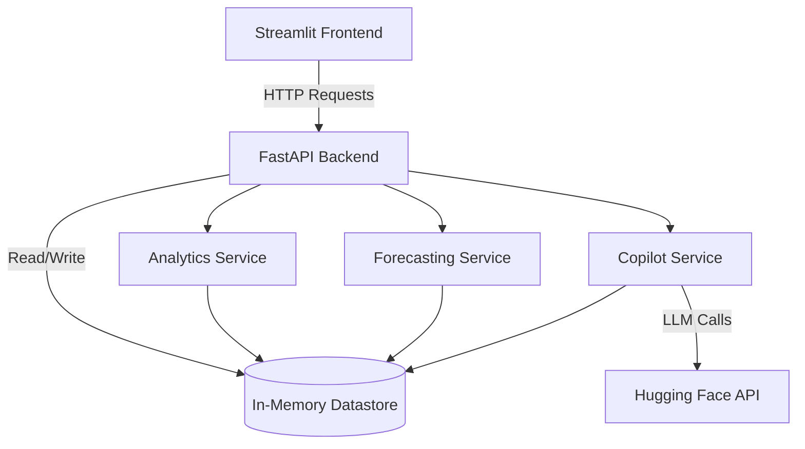

# RetailBrain - Design Document

## Overview

RetailBrain is an AI-powered retail analytics platform built with a FastAPI backend and Streamlit frontend. The system processes CSV sales data to provide real-time analytics, sales forecasting using moving averages, and an AI copilot assistant powered by Hugging Face's LLM router.

The architecture follows a service-oriented design with three core business logic services (Analytics, Forecasting, Copilot) that operate on shared in-memory data storage. The system prioritizes simplicity and rapid prototyping while maintaining clear separation of concerns.

## Architecture

### High-Level Architecture



### Component Layers

1. **Presentation Layer**: Streamlit web application providing interactive UI
2. **API Layer**: FastAPI REST endpoints handling HTTP requests/responses
3. **Service Layer**: Business logic services for analytics, forecasting, and AI copilot
4. **Data Layer**: In-memory pandas DataFrame storage
5. **External Integration**: Hugging Face LLM API for AI copilot functionality

### Technology Stack

- **Backend Framework**: FastAPI (async-capable, automatic OpenAPI docs)
- **Frontend Framework**: Streamlit (rapid prototyping, Python-based UI)
- **Data Processing**: pandas (DataFrame operations, CSV parsing)
- **AI Integration**: OpenAI Python client with Hugging Face router
- **Server**: uvicorn (ASGI server)
- **Configuration**: python-dotenv (environment variable management)

## Components and Interfaces

### 1. API Layer (main.py)

The FastAPI application serves as the entry point and orchestrator for all backend operations.

**Responsibilities**:
- HTTP request handling and routing
- CORS middleware configuration
- Data upload and storage management
- Service orchestration
- Error response formatting

**Key Components**:

```python
# Global in-memory datastore
DATASTORE: Dict[str, Optional[pd.DataFrame]] = {"df": None}

# CORS configuration
CORS_ORIGINS = [
    "http://127.0.0.1:5500",
    "http://localhost:5500"
]
```

**API Endpoints**:

1. `POST /upload`
   - Input: CSV file (multipart/form-data)
   - Output: `{"message": str, "rows": int}`
   - Side effect: Updates DATASTORE["df"]

2. `GET /dashboard/metrics`
   - Input: None (uses DATASTORE)
   - Output: Dashboard metrics object or error
   - Delegates to: `analytics.get_dashboard_metrics()`

3. `GET /forecast`
   - Input: `product: str`, `days: int = 7`
   - Output: Forecast object or error
   - Delegates to: `forecasting.get_forecast()`

4. `POST /copilot/chat`
   - Input: `query: str`
   - Output: `{"answer": str, ...}` or error
   - Delegates to: `copilot.chat_with_copilot()`
   - Guarantees: Always returns "answer" field

### 2. Analytics Service

**Module**: `Services/analytics.py`

**Purpose**: Calculate business metrics from sales data

**Function**: `get_dashboard_metrics(df: pd.DataFrame) -> Dict`

**Algorithm**:
```
1. Calculate total_revenue = sum(sales * price)
2. Group by product, sum sales, find max → top_product
3. Group by product, sum sales, find min → slow_mover
4. Filter stock < 10, get unique products → low_stock_products
5. Return metrics dictionary
```

**Output Schema**:
```python
{
    "total_revenue": float,
    "top_product": str,
    "slow_mover": str,
    "low_stock_products": List[str]
}
```

**Assumptions**:
- DataFrame contains columns: product, sales, price, stock
- At least one product exists in the data
- Sales and price are numeric values

### 3. Forecasting Service

**Module**: `Services/forecasting.py`

**Purpose**: Generate sales forecasts using moving average

**Function**: `get_forecast(df: pd.DataFrame, product: str, days: int = 7) -> Dict`

**Algorithm**:
```
1. Filter DataFrame for specified product
2. Sort by date ascending
3. Take last 7 days of sales data
4. Calculate mean of those 7 days → avg_daily_sales
5. Generate forecast: repeat avg_daily_sales for 'days' periods
6. Round to nearest integer, ensure non-negative
7. Return forecast array and metadata
```

**Output Schema**:
```python
{
    "product": str,
    "days": int,
    "forecast": List[int],  # length = days
    "avg_daily_sales": float
}
```

**Error Cases**:
- Product not found: `{"error": "Product not found"}`

**Forecasting Method**: 7-day simple moving average (SMA)
- Window size: 7 days (fixed)
- Forecast values: constant (no trend adjustment)
- Minimum value: 0 (no negative forecasts)

### 4. Copilot Service

**Module**: `Services/copilot.py`

**Purpose**: Provide AI-powered business insights using LLM

**Key Functions**:

1. `get_client() -> OpenAI`
   - Initializes OpenAI client with Hugging Face router
   - Base URL: `https://router.huggingface.co/v1`
   - API key: from HF_TOKEN environment variable
   - Raises: RuntimeError if HF_TOKEN not found

2. `summarize_data(df: pd.DataFrame) -> Dict`
   - Extracts key business metrics for LLM context
   - Returns same structure as analytics service
   - Used to build system prompt

3. `chat_with_copilot(df: pd.DataFrame, query: str) -> Dict`
   - Main copilot interface

**Algorithm**:
```
1. Extract business insights using summarize_data()
2. Build system prompt with business context
3. Call Hugging Face LLM with:
   - Model: moonshotai/Kimi-K2-Instruct-0905
   - Temperature: 0.3 (focused, deterministic)
   - Messages: system prompt + user query
4. Extract response text
5. Return structured response with answer and metadata
6. On error: return fallback response with error details
```

**Output Schema**:
```python
{
    "answer": str,  # Always present
    "provider": str,  # "huggingface" or "fallback"
    "context_used": Dict,  # Business metrics
    "error": Optional[str]  # Present on failure
}
```

**System Prompt Template**:
```
You are an AI retail copilot helping a store manager make decisions.

Business context:
- Total Revenue: {total_revenue}
- Top Product: {top_product}
- Worst Product: {slow_mover}
- Low Stock Products: {low_stock_products}

Give actionable recommendations in bullet points.
```

**Error Handling**:
- Catches all exceptions from LLM API
- Returns fallback response with error message
- Logs error details to console
- Maintains contract: always returns "answer" field

### 5. Frontend (Streamlit)

**Module**: `Frontend/app.py`

**Purpose**: Interactive web UI for RetailBrain

**Architecture**: Multi-page application with sidebar navigation

**Pages**:

1. **Home**: CSV file upload
   - File uploader widget
   - Upload button triggers POST /upload
   - Displays success message with row count

2. **Dashboard**: Analytics visualization
   - Fetches GET /dashboard/metrics
   - Displays 3-column metric layout:
     - Total Revenue
     - Top Product
     - Slow Mover
   - Lists low stock products
   - Error handling for missing data

3. **Copilot**: AI chat interface
   - Text input for user queries
   - Ask button triggers POST /copilot/chat
   - Displays AI response

4. **Forecast**: Sales prediction
   - Product name text input
   - Days slider (7-30 range, default 7)
   - Get Forecast button triggers GET /forecast
   - Displays forecast data

**Backend Communication**:
- Base URL: `http://127.0.0.1:8000`
- Uses `requests` library for HTTP calls
- No authentication or session management

## Data Models

### CSV Input Schema

Required columns for uploaded CSV files:

```python
{
    "date": str,        # Format: YYYY-MM-DD
    "product": str,     # Product name/identifier
    "sales": int,       # Units sold
    "price": float,     # Unit price
    "stock": int        # Current stock level
}
```

**Example**:
```csv
date,product,sales,price,stock
2024-01-01,Shampoo,12,5.99,8
2024-01-02,Shampoo,15,5.99,6
2024-01-01,Soap,20,1.99,40
```

### Internal Data Representation

**Datastore Structure**:
```python
DATASTORE = {
    "df": Optional[pd.DataFrame]  # None until first upload
}
```

**DataFrame Schema** (after CSV parsing):
- Inherits structure from CSV input
- Date column: string type (not parsed as datetime)
- Numeric columns: pandas infers int/float types
- No validation or type enforcement on upload

### API Response Models

**Dashboard Metrics Response**:
```python
{
    "total_revenue": float,
    "top_product": str,
    "slow_mover": str,
    "low_stock_products": List[str]
}
```

**Forecast Response**:
```python
{
    "product": str,
    "days": int,
    "forecast": List[int],
    "avg_daily_sales": float
}
```

**Copilot Response**:
```python
{
    "answer": str,
    "provider": str,
    "context_used": {
        "total_revenue": float,
        "top_product": str,
        "slow_mover": str,
        "low_stock_products": List[str]
    },
    "error": Optional[str]
}
```

**Error Response** (generic):
```python
{
    "error": str
}
```

## AI Integration Approach

### LLM Provider: Hugging Face

**Why Hugging Face Router**:
- OpenAI-compatible API (easy integration)
- Access to diverse open-source models
- No direct OpenAI API costs
- Fallback-friendly architecture

**Model Selection**: `moonshotai/Kimi-K2-Instruct-0905`
- Instruction-tuned model
- Good for business reasoning tasks
- Supports structured prompts

### Authentication

- Token-based authentication via HF_TOKEN environment variable
- Token loaded from .env file using python-dotenv
- No token rotation or refresh logic
- Missing token raises RuntimeError at client initialization

### Prompt Engineering

**System Prompt Strategy**:
- Inject current business metrics as context
- Define role: "AI retail copilot"
- Request format: "actionable recommendations in bullet points"
- Keep context concise (4 key metrics)

**Temperature Setting**: 0.3
- Lower temperature for more deterministic outputs
- Reduces hallucination risk
- Maintains consistency across similar queries

### Error Handling and Fallback

**Failure Scenarios**:
1. Missing HF_TOKEN → RuntimeError
2. Network errors → Exception caught
3. API rate limits → Exception caught
4. Invalid model response → Exception caught

**Fallback Behavior**:
- Catch all exceptions in try/except block
- Log error to console with `repr(e)`
- Return structured response with:
  - Generic fallback message
  - Error details in "error" field
  - Provider marked as "fallback"
  - Business context still included

**Contract Guarantee**:
- API layer ensures "answer" field always present
- If copilot service fails to return "answer", API adds default message
- Frontend can always display response.answer

### Context Building

**Data Summarization**:
- `summarize_data()` function extracts 4 key metrics
- Same logic as analytics service (code reuse)
- Metrics embedded in system prompt
- No raw data sent to LLM (privacy-friendly)

**Context Limitations**:
- Only current snapshot (no historical trends)
- No product-specific details beyond top/slow movers
- No date range information
- Fixed context structure (not query-adaptive)

## Correctness Properties

A property is a characteristic or behavior that should hold true across all valid executions of a system—essentially, a formal statement about what the system should do. Properties serve as the bridge between human-readable specifications and machine-verifiable correctness guarantees.

### Analytics Service Properties

**Property 1: Revenue Non-Negativity**

*For any* valid sales DataFrame with non-negative sales and price values, the calculated total revenue should be non-negative.

**Validates: Requirements TBD**

**Property 2: Top Product Existence**

*For any* non-empty sales DataFrame, the identified top product should exist in the original product list and should have the maximum total sales among all products.

**Validates: Requirements TBD**

**Property 3: Slow Mover Existence**

*For any* non-empty sales DataFrame, the identified slow mover should exist in the original product list and should have the minimum total sales among all products.

**Validates: Requirements TBD**

**Property 4: Low Stock Threshold Consistency**

*For any* sales DataFrame, all products in the low_stock_products list should have stock levels strictly less than 10, and no products with stock >= 10 should appear in the list.

**Validates: Requirements TBD**

**Property 5: Metrics Completeness**

*For any* valid sales DataFrame, the dashboard metrics response should contain all four required fields: total_revenue, top_product, slow_mover, and low_stock_products.

**Validates: Requirements TBD**

### Forecasting Service Properties

**Property 6: Forecast Length Consistency**

*For any* product and requested forecast days, the returned forecast array length should exactly equal the requested number of days.

**Validates: Requirements TBD**

**Property 7: Forecast Non-Negativity**

*For any* product forecast, all values in the forecast array should be non-negative integers (>= 0).

**Validates: Requirements TBD**

**Property 8: Moving Average Bounds**

*For any* product with historical sales data, the calculated average daily sales should be between the minimum and maximum of the last 7 days of sales (inclusive).

**Validates: Requirements TBD**

**Property 9: Product Not Found Error**

*For any* product name that does not exist in the DataFrame, the forecast function should return an error response with the key "error" and value "Product not found".

**Validates: Requirements TBD**

**Property 10: Forecast Determinism**

*For any* product and DataFrame, calling the forecast function multiple times with the same inputs should produce identical results (deterministic behavior).

**Validates: Requirements TBD**

### Copilot Service Properties

**Property 11: Answer Field Presence**

*For any* user query and DataFrame, the copilot response should always contain an "answer" field with a non-empty string value, regardless of whether the LLM call succeeds or fails.

**Validates: Requirements TBD**

**Property 12: Context Consistency**

*For any* DataFrame, the business context extracted by summarize_data() should match the metrics calculated by the analytics service for the same DataFrame.

**Validates: Requirements TBD**

**Property 13: Fallback Error Handling**

*For any* LLM API failure, the copilot should return a response with provider="fallback" and include an "error" field describing the failure.

**Validates: Requirements TBD**

### API Layer Properties

**Property 14: Upload Response Consistency**

*For any* valid CSV file upload, the response should contain a "rows" field whose value equals the number of rows in the uploaded DataFrame.

**Validates: Requirements TBD**

**Property 15: No Data Error Handling**

*For any* API endpoint call (dashboard, forecast, copilot) when DATASTORE["df"] is None, the response should contain an "error" field indicating no data has been uploaded.

**Validates: Requirements TBD**

**Property 16: CORS Origin Validation**

*For any* HTTP request from an allowed origin (127.0.0.1:5500 or localhost:5500), the response should include appropriate CORS headers allowing the request.

**Validates: Requirements TBD**

### Data Processing Properties

**Property 17: CSV Parsing Idempotence**

*For any* valid CSV file, uploading it twice should result in identical DataFrame contents in DATASTORE (last upload wins, no accumulation).

**Validates: Requirements TBD**

**Property 18: Product Grouping Consistency**

*For any* DataFrame with multiple rows for the same product, grouping by product and summing sales should produce a total that equals the sum of all individual sales values for that product.

**Validates: Requirements TBD**

### Integration Properties

**Property 19: End-to-End Data Flow**

*For any* CSV file uploaded through the API, subsequent calls to dashboard/metrics should reflect the data from that CSV file (no stale data).

**Validates: Requirements TBD**

**Property 20: Service Independence**

*For any* DataFrame, calling analytics, forecasting, and copilot services in any order should not affect each other's results (no shared mutable state between services).

**Validates: Requirements TBD**

## Error Handling

### Error Categories

1. **Data Validation Errors**
   - Missing required CSV columns
   - Invalid data types
   - Empty DataFrames

2. **Business Logic Errors**
   - Product not found in forecast
   - No data uploaded (DATASTORE empty)

3. **External Service Errors**
   - Hugging Face API failures
   - Network timeouts
   - Authentication errors (missing HF_TOKEN)

4. **HTTP Errors**
   - CORS violations
   - Invalid request parameters
   - File upload failures

### Error Handling Strategies

**API Layer**:
- Check DATASTORE["df"] is not None before service calls
- Return `{"error": "No data uploaded"}` for missing data
- Let pandas raise exceptions for invalid CSV parsing
- No try/except in main.py (relies on FastAPI default error handling)

**Analytics Service**:
- Assumes valid DataFrame structure
- No explicit error handling
- Relies on pandas to raise exceptions for missing columns
- IndexError possible if DataFrame is empty (not handled)

**Forecasting Service**:
- Explicit check: `if product_df.empty`
- Returns error dict: `{"error": "Product not found"}`
- No handling for invalid days parameter (accepts any int)
- Assumes date column exists (no validation)

**Copilot Service**:
- Comprehensive try/except around LLM call
- Catches all exceptions: `except Exception as e`
- Logs error: `print("HF AI ERROR >>>", repr(e))`
- Returns fallback response with error details
- RuntimeError for missing HF_TOKEN (not caught)

**Frontend**:
- Checks for "error" key in API responses
- Displays error using `st.error()`
- No retry logic
- No loading states or timeouts

### Error Response Format

**Standard Error Response**:
```python
{
    "error": str  # Human-readable error message
}
```

**Copilot Error Response** (special case):
```python
{
    "answer": str,  # Fallback message
    "error": str,  # Technical error details
    "provider": "fallback",
    "context_used": Dict
}
```

### Unhandled Edge Cases

1. **Empty DataFrame after upload**: Analytics service will raise IndexError
2. **Missing CSV columns**: pandas will raise KeyError (not caught)
3. **Invalid date formats**: Not validated, treated as strings
4. **Concurrent uploads**: Race condition possible (DATASTORE not thread-safe)
5. **Memory exhaustion**: Large CSV files could cause OOM (no size limits)
6. **Invalid forecast days**: Negative or zero days not validated

## Testing Strategy

### Dual Testing Approach

RetailBrain requires both unit testing and property-based testing for comprehensive coverage:

- **Unit tests**: Verify specific examples, edge cases, and error conditions
- **Property tests**: Verify universal properties across all inputs

Both testing approaches are complementary and necessary. Unit tests catch concrete bugs with specific inputs, while property tests verify general correctness across a wide range of generated inputs.

### Property-Based Testing

**Framework**: Use `hypothesis` library for Python property-based testing

**Configuration**:
- Minimum 100 iterations per property test (due to randomization)
- Each test must reference its design document property
- Tag format: `# Feature: retail-brain, Property {number}: {property_text}`

**Test Organization**:
```
RetailBrain/Backend/Tests/
├── test_analytics_properties.py
├── test_forecasting_properties.py
├── test_copilot_properties.py
└── test_integration_properties.py
```

**Example Property Test Structure**:
```python
from hypothesis import given, strategies as st
import pandas as pd

# Feature: retail-brain, Property 1: Revenue Non-Negativity
@given(
    sales=st.lists(st.integers(min_value=0, max_value=1000), min_size=1),
    prices=st.lists(st.floats(min_value=0.0, max_value=100.0), min_size=1)
)
def test_revenue_non_negativity(sales, prices):
    # Generate DataFrame
    # Call get_dashboard_metrics
    # Assert total_revenue >= 0
    pass
```

**Property Test Coverage**:
- Properties 1-5: Analytics service (test_analytics_properties.py)
- Properties 6-10: Forecasting service (test_forecasting_properties.py)
- Properties 11-13: Copilot service (test_copilot_properties.py)
- Properties 14-20: API and integration (test_integration_properties.py)

### Unit Testing

**Framework**: Use `pytest` for unit testing

**Test Organization**:
```
RetailBrain/Backend/Tests/
├── test_analytics_unit.py
├── test_forecasting_unit.py
├── test_copilot_unit.py
└── test_api_unit.py
```

**Unit Test Focus Areas**:

1. **Specific Examples**:
   - Known input/output pairs
   - Sample CSV data from documentation
   - Typical user scenarios

2. **Edge Cases**:
   - Empty DataFrames
   - Single-row DataFrames
   - Products with zero sales
   - Missing HF_TOKEN
   - Network failures (mocked)

3. **Error Conditions**:
   - Product not found
   - No data uploaded
   - Invalid CSV format
   - LLM API failures

4. **Integration Points**:
   - CSV upload and parsing
   - Service orchestration in API layer
   - Frontend-backend communication (mocked)

**Example Unit Test**:
```python
def test_dashboard_metrics_sample_data():
    # Load sample_sales.csv
    df = pd.read_csv("Data/sample_sales.csv")
    
    # Call analytics service
    metrics = get_dashboard_metrics(df)
    
    # Assert specific expected values
    assert metrics["total_revenue"] > 0
    assert metrics["top_product"] in ["Shampoo", "Soap", "Toothpaste"]
    assert "Shampoo" in metrics["low_stock_products"]
```

### Testing Balance

- **Avoid excessive unit tests**: Property-based tests handle comprehensive input coverage
- **Focus unit tests on**:
  - Concrete examples that demonstrate correct behavior
  - Integration points between components
  - Specific edge cases and error conditions
- **Use property tests for**:
  - Universal properties that hold for all inputs
  - Comprehensive input coverage through randomization
  - Invariant validation

### Test Execution

**Run all tests**:
```bash
cd RetailBrain/Backend
pytest Tests/ -v
```

**Run property tests only**:
```bash
pytest Tests/test_*_properties.py -v
```

**Run unit tests only**:
```bash
pytest Tests/test_*_unit.py -v
```

**Coverage reporting**:
```bash
pytest --cov=Services --cov-report=html
```

### Mocking Strategy

**External Dependencies to Mock**:
1. Hugging Face API calls (in copilot tests)
2. File uploads (in API tests)
3. HTTP requests (in frontend tests)

**Mocking Libraries**:
- `unittest.mock` for Python mocking
- `pytest-mock` for pytest integration
- `responses` for HTTP mocking

**Example Mock**:
```python
from unittest.mock import patch, MagicMock

def test_copilot_fallback():
    with patch('Services.copilot.get_client') as mock_client:
        mock_client.side_effect = Exception("API Error")
        
        result = chat_with_copilot(df, "test query")
        
        assert result["provider"] == "fallback"
        assert "error" in result
        assert "answer" in result
```

### Continuous Integration

**Recommended CI Setup**:
- Run all tests on every commit
- Fail build if any test fails
- Generate coverage reports
- Property tests run with 100 iterations minimum

**GitHub Actions Example**:
```yaml
name: Tests
on: [push, pull_request]
jobs:
  test:
    runs-on: ubuntu-latest
    steps:
      - uses: actions/checkout@v2
      - uses: actions/setup-python@v2
        with:
          python-version: '3.8'
      - run: pip install -r requirements.txt pytest hypothesis pytest-cov
      - run: pytest Tests/ -v --cov=Services
```
